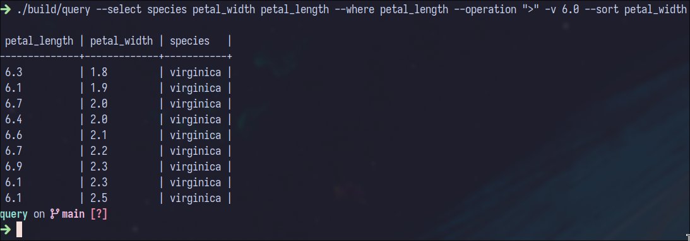

# Query
A lightweight SQL-like query engine for CSV files, built in C++ as a learning project.

## Features
- Filter rows with comparison operators (==, >, <)
- Select specific columns
- Sort results by any column (numeric or string)
- Pretty-printed table output

## Building
Requires a C++23 compiler (GCC 13+ or Clang 16+).
Includes a Makefile. You can just do make.
```bash
make clean && make
```
Binary outputs to **/build/query**

## Usage
```bash 
./build/query --select col1 col2 col3 --where column --operation ">" -v value --sort column
```

### Example:
```bash 
./build/query --select species petal_width petal_length --where petal_length --operation ">" -v 6.0 --sort species
```

This would output:



## Limitations
- Single CSV schema (hardcoded for iris.csv structure)
- No JOIN, GROUP BY, or aggregate functions
- Single condition filtering only (no AND/OR)

## Dependencies
Included as vendored headers (no installation needed):
- CSV Parser by Ben Strasser
- CLI11
